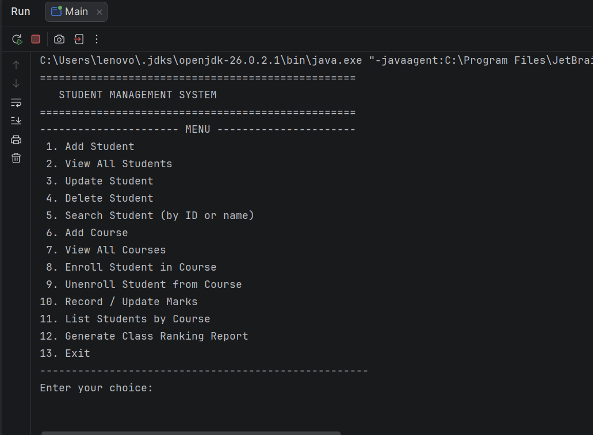

# Student Management System

A terminal-based Java application for managing student records, course
enrollment, and academic performance for an institution. Built as a core
Java course project to practice OOP, the Collections Framework, and JDBC.

## Features Implemented

- Add, view, update, and delete student records (name, contact, email)
- Add and view courses
- Enroll / unenroll students in courses (prevents duplicate enrollment)
- Record and update marks per student per course
- Automatically computed average marks per student
- Search students by ID or by (partial) name
- List all students enrolled in a given course
- Generate a class ranking report (sorted by marks, highest first)
- Menu-driven console interface with input validation (rejects
  non-numeric input and empty fields)
- Data is stored in MySQL, so it persists between program runs

## Technologies Used

| Technology | Purpose |
|---|---|
| Java (JDK 11+) | Core application logic |
| MySQL | Relational database |
| JDBC (mysql-connector-j) | Database connectivity |
| Maven | Dependency and build management |
| Git / GitHub | Version control |

No frameworks (Spring Boot, JavaFX, etc.) are used — this is a plain
core-Java terminal application, as required by the assignment.

## Project Structure

```
StudentManagementSystem/
├── pom.xml
├── schema.sql
├── db.properties.example
├── .gitignore
├── README.md
└── src/main/java/studentmanagement/
    ├── Main.java                       -> menu-driven console entry point
    ├── model/
    │   ├── Person.java                 -> abstract base class
    │   ├── Student.java                -> extends Person
    │   ├── Course.java
    │   └── Enrollment.java
    ├── exception/
    │   ├── RecordNotFoundException.java     -> custom checked exception
    │   └── DuplicateEnrollmentException.java -> custom checked exception
    ├── util/
    │   └── DBConnection.java           -> loads credentials, opens JDBC connections
    ├── dao/
    │   ├── StudentDAO.java             -> CRUD for students
    │   ├── CourseDAO.java              -> CRUD for courses
    │   └── EnrollmentDAO.java          -> enroll/unenroll, marks, ranking
    └── service/
        └── StudentService.java         -> business logic + in-memory cache
```

## Java / OOP Concepts Used

- **Encapsulation** – all model classes use private/protected fields with
  public getters and setters.
- **Inheritance** – `Student` extends the abstract `Person` class.
- **Abstraction** – `Person` is abstract and declares `displayInfo()` and
  `getRole()` as abstract methods that `Student` must implement.
- **Polymorphism** – method *overriding* (`Student.displayInfo()` overrides
  `Person.displayInfo()`) and method *overloading*
  (`StudentService.searchStudent(int id)` vs. `searchStudent(String name)`).
- **Collections Framework** – `ArrayList` (ordered lists of students/courses
  returned from the DAOs), `HashMap` (fast id → Student cache in
  `StudentService`, and courseId → marks inside `Student`), and
  `Comparator` (sorting the class ranking report by marks).
- **Exception Handling** – custom checked exceptions
  (`RecordNotFoundException`, `DuplicateEnrollmentException`) plus
  meaningful handling of `SQLException` in `Main` (no empty catch blocks,
  no silent failures).
- **JDBC** – `PreparedStatement` for every query that includes user input
  (no string-concatenated SQL), and `try-with-resources` everywhere a
  `Connection`, `PreparedStatement`, or `ResultSet` is opened.

## Database Design

Database: `student_management`

**students** — `id` (PK, auto increment), `name`, `contact`, `email`

**courses** — `id` (PK, auto increment), `course_name`, `credits`

**enrollments** — `id` (PK), `student_id` (FK → students.id),
`course_id` (FK → courses.id), `marks` (nullable until graded).
A unique constraint on `(student_id, course_id)` prevents duplicate
enrollments at the database level as well as in application code.

See [`schema.sql`](./schema.sql) for the full CREATE TABLE statements.

## Setup & Run Instructions

### 1. Create the database

Make sure MySQL is installed and running, then:

```bash
mysql -u root -p < schema.sql
```

### 2. Configure credentials

Copy the example properties file and fill in your own MySQL username/password:

```bash
cp db.properties.example db.properties
```

Then edit `db.properties`. This file is git-ignored, so your password is
never committed.

### 3. Build and run (Maven)

```bash
mvn compile exec:java
```

Or build a runnable jar and execute it:

```bash
mvn package
java -jar target/student-management-system.jar
```

### 3b. Build and run without Maven (plain javac/java)

Download `mysql-connector-j` (the MySQL JDBC driver `.jar`) manually and
place it in a `lib/` folder, then:

```bash
javac -d out -cp "lib/*" $(find src -name "*.java")
java -cp "out:lib/*" studentmanagement.Main       # Linux/macOS
java -cp "out;lib/*" studentmanagement.Main       # Windows
```

## Screenshots




## Known Limitations

- No authentication / login system (single-user console app).
- No pagination — `View All Students` prints every row at once.
- Marks are a single numeric field per course (no separate
  assignment/exam breakdown).
- No automated tests included.

## GitHub Repository

Replace this line with your actual repository link before submission:

`GitHub Repository: https://github.com/<your-username>/student-management-system`

## Requirements
- Java JDK 11 or above
- MySQL Server
- Maven